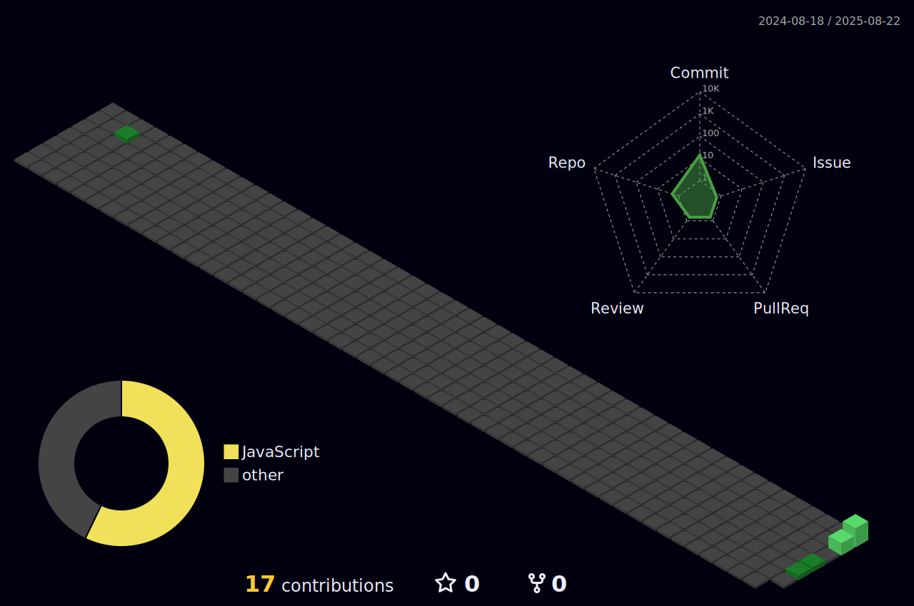

<h1 align="center">
 Hola, soy balam
</h1>

  

---

## Sobre mí  
- 💻 Desarrollador **Full Stack Web**  
- 🌱 Actualmente explorando **DevOps y Cloud**  
---

##  Tech & Stats  

<table align="center">
<tr>
<td align="center" width="50%">

  

</td>

<td align="center" width="50%">

###  Estadísticas  

  

  
  

</td>
</tr>
</table>
